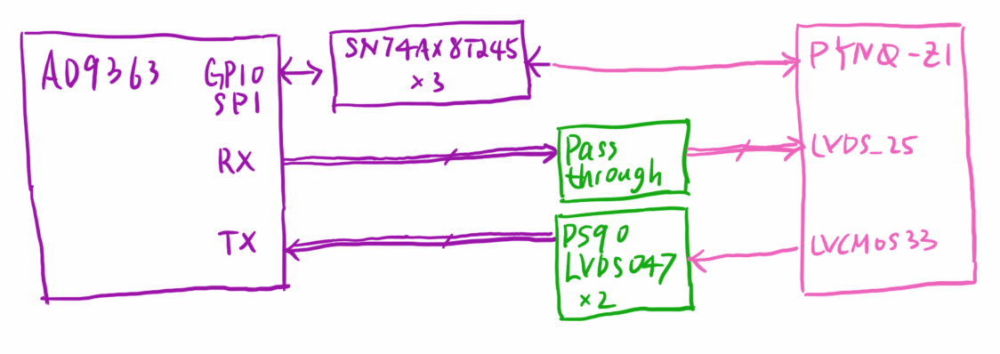
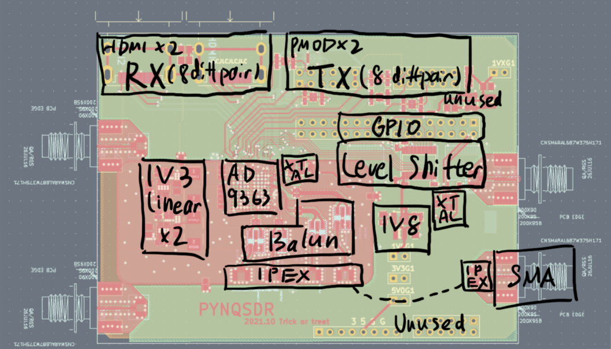

#### Design

*Maybe you should first have a look at AD9363 + ZYNQ schematics of [PlutoSDR](https://wiki.analog.com/_media/university/tools/pluto/hacking/plutosdr_schematic_revd_0.1.pdf), [ANTSDR](https://github.com/MicroPhase/antsdr-fw/blob/master/schematic/ant_e310_Public.pdf), and [kangyuzhe666's SDR](https://github.com/kangyuzhe666/ZYNQ7010-7020_AD9363).*

A series of "hacking" is required to get things work. 

- AD936X run on 1.8 V or 2.5 V, while most FPGA boards have VCCIO 3.3 V
  - Use level converters like SN74AX8T245. Changing VCCIO is not plausible because USB and ETH PHY need 3.3 V
- Wiring is both poor and long on FPGA boards
  - So have to use LVDS mode. Openwifi needs LVDS anyways
  - Have to stick to 1RX 1TX. But that's enough for most applications
- But ZYNQ with 3.3 V HP VCCIO can't run LVDS
  - For receiving, HDMI can run TMDS_33. So re-drive using SN65CML100 -- NO change on PYNQ-Z1
    - Can also change 50 R pullup to 100 R series termination and directly receiving LVDS
    - Can also remove 50 R pullup and use DS90LVDS048A receiver
  - For sending, I use single-ended output on FPGA, and convert these to LVDS using DS90LVDS047
- PMOD can't run high speed
  - Yet it can run at 80 MHz (40 M sampling rate 1rx-1tx), enough for openwifi, dump1090, and everything else I tried
  - Optionally remove TVS diodes and 200 ohm series resistors, can run at 120 MHz (~61.44 M sampling rate 1rx-1tx)
- Board shape is strange...
  - Small connectors on PMOD/HDMI side is required
  - I'm worried about mechanical strains caused by HDMI bridges, so using short HDMI cables is being considered. 
- Hand-solder BGA?
  - Heatgun, soldering iron, solder paste, flux are enough, it's really not that hard
  - **warning**: Boards after SMT assembly will suffer oxidation when re-flowing, so ordering SMT assembly w/o the BGA chip then manually solder the BGA may not work well

#### Future plan

V1.2 seems good and will be for sale soon. Another batch(v1.2.1) with minor modification will come soon. 

...

Another 5 fabricated and proved to be fine. Another batch(v1.2) coming soon. 

...

Boards version 1.1 have been made and manually assembled using 1.0's material. It works fine, so another batch of 5 will be made in late Feb. 2022. 

...

Boards version 1.0 suffered BGA soldering problems because they have been re-flowed during STM assembly. 

...

Since I'm confident unmodified PYNQ-Z1 can make it, board version 1.0 will be designed and sent to fabrication and SMT assembly before Dec 31, 2021. 5 boards are to be made. 

If the 5 boards turn to be OK, more will be coming. 

---

Design "explained"(initial testing version, **deprecated**):

