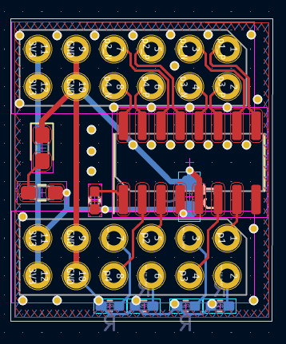

### PYNQSDR Quick Start

#### Board 

Plug extension boards together, make sure the PMOD plugins are in correct direction -- the 3V3/GND is on the left and IC is on the right: 



Setup PYNQ-Z1 jumpers to boot from SD card. Use a stable power supply and avoid using USB hubs. Use a good ethernet cable. 

#### Firmware

SD card's boot partition contains boot files, for PlutoSDR, put these into root directory:

```
uEnv.txt -- u-boot loading script
boot.bin -- ZYNQ FSBL including bitstream
uImage -- Linux kernel
devicetree.dtb -- Linux device tree
uramdisk.image.gz -- Linux root directory
```

For openwifi(all of these are different from the Pluto ones!): 

```
uEnv.txt
boot.bin
uImage
devicetree.bin
```

#### Power on

Turn on the power, you'll see the red power LED on -- if this doesn't happen, immediately power off and check your board -- there's probably a short. After ~0.5s LD0-LD3 will have some action after bitstream is loaded. 

#### Connect

*Pluto*

Linux terminal on USB serial port 115200 baud, root password is `analog`. Set host ethernet IP to 192.168.1.2, board IP will be 192.168.1.10. 

*Openwifi*

Set host ethernet IP to 192.168.10.1, board IP will be 192.168.10.122, ssh into board, username: root, password: `openwifi`. USB serial port has early boot message but will stop after kernel booting. 

#### Pluto

This blog for setup. 

https://regymm.github.io/MyBlog/experience/2022/01/13/plutosdr-setup.html

#### Openwifi 

Manually tune RX/TX: 

```
cd /sys/bus/iio/devices/iio\:device1
echo 40000000 > in_voltage_sampling_frequency

cd /sys/kernel/debug/iio/iio\:device1/
echo 0 > adi,digital-interface-tune-skip-mode 
echo 0 3 > digital_tune

dmesg
```

Start wifi:

`~/openwifi/fosdem-11ag.sh`

*If you are building firmware youself: my board seems to need 10 dB TX attenuation for best transmission, so `#define AD9361_RADIO_ON_TX_ATT 10000` in sdr.h*

#### Troubleshooting

Just contact me...