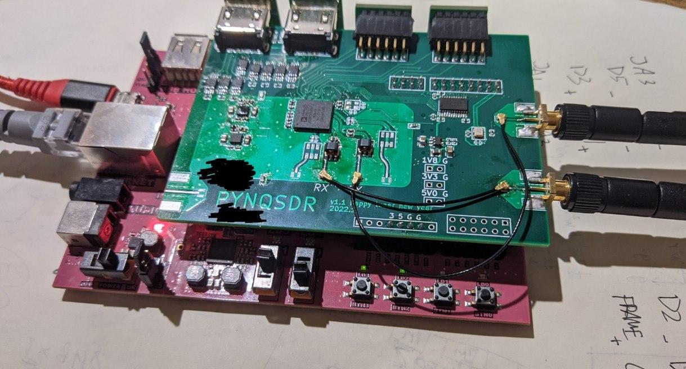
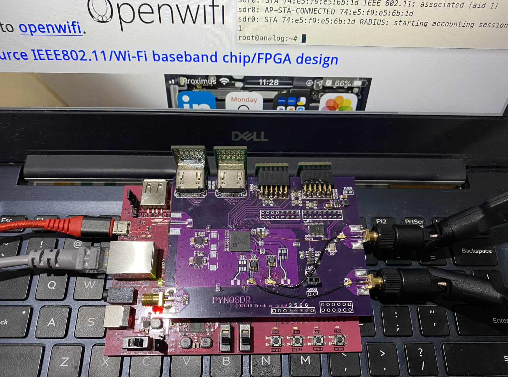
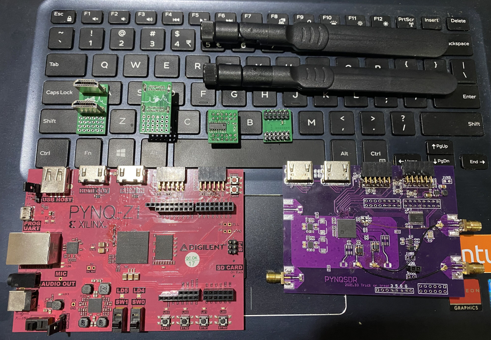

## PYNQSDR

PYNQ-Z1 + AD936X SDR platform and more. Openwifi & PlutoSDR capable. 

[KiCad files](./kicad) **|** [Design & future plan](Design.md) **|** [Talk on FOSDEM 2022](https://fosdem.org/2022/schedule/event/openwifipynqz1/) [Slides](doc/openwifi_pynqz1.pdf) **|** [Blog TBD] **|** [Quick start](Quickstart.md) **|** [EBAZSDR TBD]

**Blogs and new boards coming soon, stay tuned!**

This project demonstrated that AD936X chip can combine with low-cost ZYNQ FPGA development boards, especially PYNQ-Z1, and run openwifi without problem. This can potentially become an extremely low-cost openwifi platform. And with extensions removed, you still have a PYNQ capable of any other serious ZYNQ projects. 

Going beyond PYNQ-Z1, this extension board can also combine with other hardware by easy 2-layer conversion board and provide even lower-cost platforms. 

#### Gallery

V1.1 board that works: 

Openwifi running on PYNQSDR: 

Board anatomy: 

#### Credits

Openwifi: https://github.com/open-sdr/openwifi

PlutoSDR: https://github.com/analogdevicesinc/plutosdr-fw

RF frontend PCB design based on https://github.com/kangyuzhe666/ZYNQ7010-7020_AD9363

Many online discussion groups also gave me a lot of help. 

#### License

GPLv3 for all board files. CC BY-SA for blog articles, documents, photos and the logo. Code are coming from different projects and should remain their original licenses. 